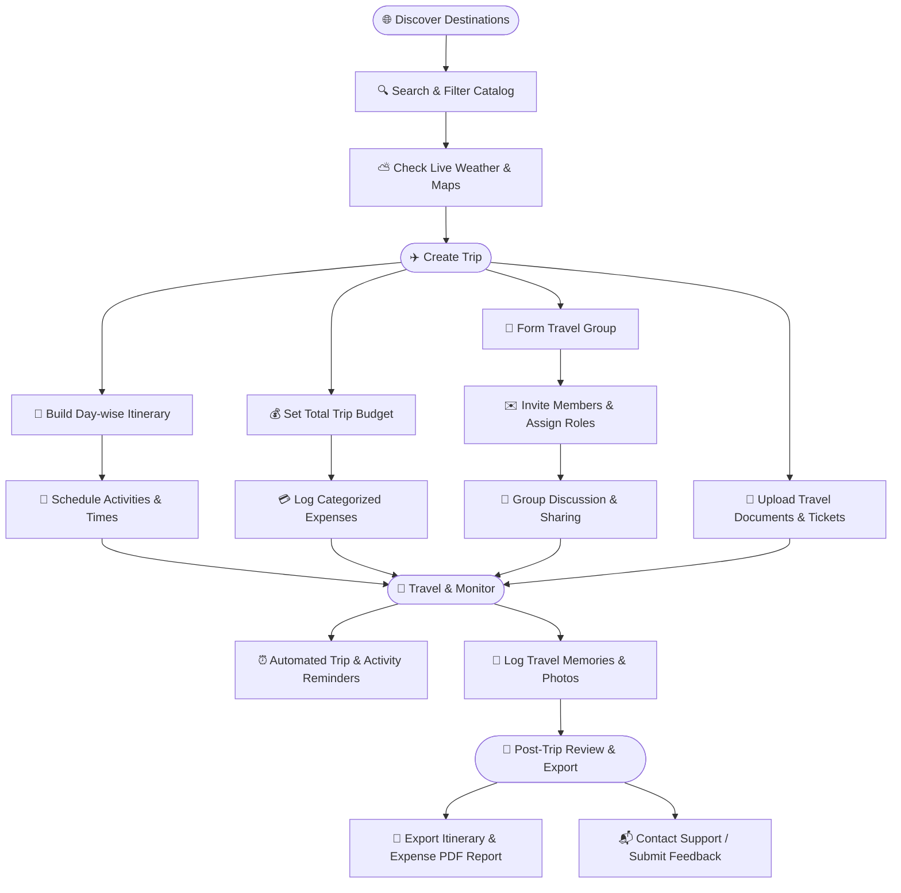
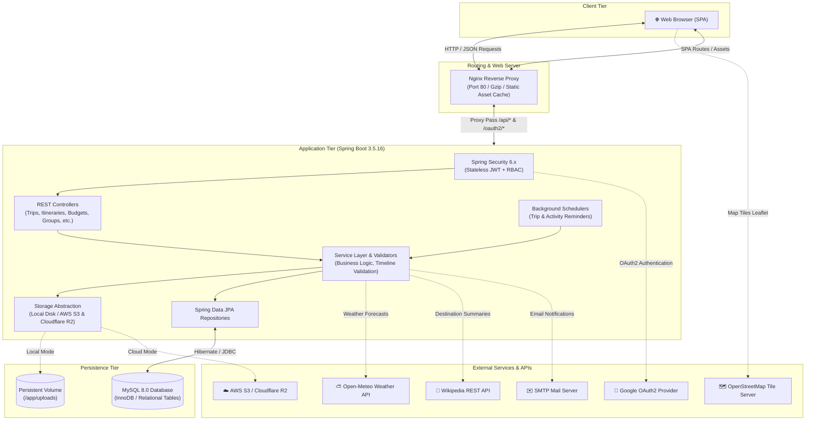

# 🧳 TripNest

**A full-stack travel planning and trip management platform designed to unify itineraries, budgeting, group collaboration, document storage, and destination discovery into a single seamless experience.**

[](https://github.com/Sach-in-SE/TripNest)
[](https://www.oracle.com/java/)
[](https://spring.io/projects/spring-boot)
[](https://react.dev/)
[](https://vitejs.dev/)
[](https://www.mysql.com/)
[](https://www.docker.com/)
[](#license)

---

## 📌 Overview

TripNest is an all-in-one travel planning and management platform that eliminates the fragmentation of modern trip organization. Instead of juggling spreadsheets, chat groups, note applications, and booking files, travelers can plan and coordinate every facet of their journey through a unified web interface.

### The Problem TripNest Solves
- **Fragmented Itinerary Management**: Daily activities, schedules, and reservations often end up scattered across disparate apps and email threads.
- **Unclear Budget Tracking**: Group and solo travelers struggle to keep real-time track of categorized expenses against strict trip budgets.
- **Coordination Overhead**: Sharing itineraries, gathering inputs from friends or family, and tracking member roles is cumbersome without dedicated collaborative tools.
- **Document & Memory Vaults**: Critical travel tickets, hotel vouchers, and memory snapshots are hard to organize and retrieve on the go.

### What Users Can Do With TripNest
- Organize day-by-day itineraries with granular activity scheduling and cost tracking.
- Track trip budgets with real-time categorized expenditures and visual utilization metrics.
- Form collaborative travel groups, invite members, assign viewing/editing permissions, and exchange messages in group chats.
- Explore global destinations with live weather forecasts, interactive maps, and external encyclopedia insights.
- Store travel vouchers securely in a document vault and record photo journals with privacy controls.
- Receive automated countdown reminders and scheduled activity notifications.
- Manage platform operations through a dedicated administrative control center.

---

## 🗺️ Product Workflow

The following diagram illustrates the primary user journey from destination discovery through trip completion:



---

## 🏛️ System Architecture

TripNest is built on a multi-tier containerized architecture separating presentation, reverse proxy routing, RESTful application logic, data persistence, and external service providers:



---

## ✨ Core Features

### 1. Authentication & User Management
- **Stateless JWT Authentication**: Secure signup, login, and bearer-token generation with configurable expiration times.
- **Google OAuth2 Single Sign-On**: One-click authentication with Google user account provisioning and profile synchronization.
- **Token-Based Password Reset**: Time-limited password reset tokens delivered via automated email service.
- **Real-Time Availability Checks**: Live validation endpoints for username (`/api/auth/check-username`) and email (`/api/auth/check-email`) availability during registration.
- **Disposable Email Blocking**: Domain validation filtering out temporary/throwaway email services to preserve account integrity.
- **User Profiles & Preferences**: Comprehensive profile fields including personal bio, residence (city/state/country), emergency contacts (name, relationship, phone), and travel preferences (travel styles, transportation options, budget ranges, dream destinations).
- **Profile Picture Management**: Avatar upload and removal with image format validation (JPEG, PNG) and file size constraints (2MB).
- **Credential Updates**: In-app password change and username updates with dynamic JWT reissue.

### 2. Trip Planning & Itinerary Management
- **Trip Lifecycle Management**: Complete lifecycle tracking with statuses: `PLANNING`, `UPCOMING`, `ONGOING`, `COMPLETED`, and `CANCELLED`.
- **Strict Timeline Validation**: Automated date validation (`TripTimelineValidator`) ensuring activities, itineraries, and expenses fall within trip start and end boundaries.
- **Day-Wise Itinerary Planning**: Granular day-by-day scheduling with customizable daily notes.
- **Activity Scheduling**: Detailed activity logging categorized into *Sightseeing, Transportation, Accommodation, Dining, Adventure, Shopping,* and *Other*, complete with time ranges, locations, and costs.
- **Client-Side PDF Report Generation**: Multi-page PDF travel reports (`jspdf` + `jspdf-autotable`) featuring trip overview cards, day-by-day itineraries, expense summaries, and category breakdowns.

### 3. Destinations & Travel Insights
- **Curated Global Catalog**: Searchable catalog of destinations categorized by *Beach, Mountains, Historical, Adventure, Spiritual, Wildlife,* and *City*, with ratings, estimated budgets, and recommended stay durations.
- **Search & Filtering**: Search across destination names, states, and countries with category filters and sorting by name, rating, or budget.
- **Live Weather Forecasts**: Real-time weather conditions, apparent temperatures, humidity, wind speeds, and 5-day daily forecasts powered by the **Open-Meteo REST API** with 15-minute in-memory caching.
- **Interactive Location Maps**: Geospatial coordinate visualization using **Leaflet / OpenStreetMap** (`react-leaflet`) with marker popups and responsive map recentering.
- **Destination Encyclopedia Insights**: Automated destination overview extracts fetched via the **Wikipedia REST API** with 1-hour in-memory caching.
- **Geospatial Nearby Discovery**: Haversine formula calculation to automatically display the closest neighboring destinations within the catalog.
- **Favorites Management**: Personal favorite destination bookmarks for quick access.

### 4. Budget & Expense Management
- **Budget Allocation**: Trip-level budget assignment with real-time remaining balance and utilization percentage tracking.
- **Categorized Expense Logging**: Individual expense entries categorized into *Transportation, Hotel, Food, Shopping, Entertainment,* and *Miscellaneous*.
- **Financial Breakdowns**: Aggregated expense totals, remaining budget indicators, and itemized transaction histories.

### 5. Memories & Document Vault
- **Travel Memories Diary**: Photo journal allowing travelers to record travel moments with title, caption, location tags, trip association, and privacy controls (`PUBLIC` vs. `PRIVATE` visibility).
- **Strict File Security Validation**: File inspection enforcing allowed extensions (PDF, DOCX, TXT, JPEG, PNG, WEBP), MIME types, and magic bytes header verification against malicious executable formats (ELF, MZ).
- **Document Vault**: Storage for tickets, booking vouchers, visas, and insurance policies with scoped user and collaborator download access.
- **Storage Subsystem Abstraction**: Delegating storage service supporting local disk storage (`LocalStorageService`) and S3-compatible cloud storage (`S3CloudStorageService` supporting AWS S3, Cloudflare R2, and MinIO).

### 6. Collaboration & Group Travel
- **Travel Groups**: Create dedicated travel groups linked to specific trips.
- **Membership & Roles**: Multi-tier group roles (`OWNER`, `MEMBER`) with member invitation, acceptance, decline, and removal workflows.
- **Granular Trip Sharing**: Scoped trip sharing granting collaborators either `VIEW` (read-only) or `EDIT` (collaborative editing of itineraries, expenses, and documents) access.
- **Persistent Group Discussion**: In-app group discussion room with auto-scrolling and 4-second interval polling for message synchronization.
- **Ownership Transfer**: Group owners can securely transfer complete group and trip ownership to accepted members.

### 7. Notifications & Scheduling Engine
- **In-App Notification Center**: Notification inbox supporting unread counters, mark as read, mark all read, and deletion.
- **Automated Trip Reminders**: Background cron scheduler (`TripReminderScheduler`) delivering 7-day, 3-day, and 24-hour countdown reminders, trip start notifications, and completion summaries.
- **Configurable Activity Alerts**: Fixed-rate scheduler (`ActivityReminderScheduler`) checking every 5 minutes to trigger 30-minute, 1-hour, 2-hour, or 1-day reminders before scheduled activities.
- **User Preference Controls**: User-customizable toggles for trip reminders, activity alerts, email notifications, and group updates.

### 8. Admin Control Center
- **Protected Administrator Portal**: Dedicated admin routes (`/admin/*`) guarded by `AdminPrivateRoute` and backend `hasRole('ADMIN')` authorization.
- **Platform Analytics Dashboard**: High-level metrics tracking total/active/disabled user accounts, active and completed trips, cataloged destinations, and total system budget vs. expenditures.
- **Interactive Visual Charts**: Real-time graphical analytics powered by **Chart.js** (User role distribution doughnut, trip status breakdown doughnut, destination category distribution bar chart, and budget vs. expense comparison bar chart).
- **User Directory Management**: Search, filter, view complete user profiles, toggle account active/disabled status, edit assigned security roles, and generate 24-hour temporary password resets.
- **Destination Catalog Management**: Full CRUD interface to create, edit, delete, and view cataloged destinations with coordinate configuration and image links.
- **Administrative Reporting Center**: Export system executive summaries, user directory security audits, and destination catalogs in formatted PDF (with Unicode font loading) and CSV formats.

### 9. Contact & Support System
- **Public Contact Form**: Responsive contact submission form with live field validation across categories (*General Inquiry, Bug Report, Product Feedback, Feature Request, Other*).
- **User Linkage**: Automatically attaches authenticated user details while supporting unauthenticated public visitor submissions.
- **Admin Support Inbox**: Complete ticketing desk with status filters (`NEW`, `READ`, `RESOLVED`, `ARCHIVED`), keyword search, and unread counters.
- **Ticket Workflow**: Detailed ticket inspection modals, automated status updates upon reading, resolution marking, archiving, and permanent ticket deletion.

---

## 👥 User Roles & Access Matrix

TripNest enforces role-based access control (RBAC) across three primary user roles:

| Role | Scope | Key Capabilities |
|---|---|---|
| **Traveler (User)** | Personal & Shared Trips | Create and manage personal trips, build day-wise itineraries, log expenses, bookmark favorite destinations, upload documents and memories, join travel groups, receive reminder notifications, submit contact inquiries. |
| **Group Admin** | Travel Groups & Shared Trips | Create travel groups, invite and remove members, delegate `VIEW`/`EDIT` permissions on shared trips, manage group discussions, transfer group ownership. |
| **Administrator** | Platform-wide Control Center | Access the Admin Portal, inspect real-time system metrics and charts, manage user account statuses and roles, issue temporary credentials, manage the global destination catalog, manage the support inbox, export PDF/CSV audit reports. |

---

## 💻 Technology Stack

### Frontend
| Technology | Version | Description |
|---|---|---|
| **React** | `19.2.7` | UI component library with Hooks and Context API |
| **Vite** | `8.1.1` | Next-generation frontend build tool and dev server |
| **React Router** | `7.18.1` | Client-side routing and route protection |
| **Axios** | `1.18.1` | HTTP client with automatic JWT bearer token interceptors |
| **Chart.js & react-chartjs-2** | `4.5.1` / `5.3.1` | Interactive graphical charts for analytics dashboards |
| **Leaflet & react-leaflet** | `1.9.4` / `5.0.0` | Geospatial maps with OpenStreetMap tile rendering |
| **jsPDF & jspdf-autotable** | `4.2.1` / `5.0.8` | Client-side PDF generation for travel and audit reports |
| **Oxlint** | `1.71.0` | High-performance JavaScript/JSX linter |

### Backend
| Technology | Version | Description |
|---|---|---|
| **Java** | `17` | Long-Term Support (LTS) Java development platform |
| **Spring Boot** | `3.5.16` | Enterprise Java REST application framework |
| **Spring Security** | `6.x` | Stateless authentication, authorization, and CORS filtering |
| **Spring Data JPA** | `3.5.x` | Data persistence and repository abstraction |
| **Hibernate** | `6.x` | Object-Relational Mapping (ORM) and schema management |
| **JJWT** | `0.11.5` | JSON Web Token parsing, validation, and generation |
| **Spring Mail** | `3.5.x` | SMTP email dispatching for token resets and alerts |
| **Spring Boot Actuator** | `3.5.x` | Health check probes and operational endpoints |
| **AWS Java SDK S3** | `1.12.750` | S3-compatible cloud storage integration (AWS / Cloudflare R2 / MinIO) |
| **spring-dotenv** | `4.0.0` | Environment variable loader for local `.env` files |
| **Lombok** | — | Boilerplate reduction for entity and DTO classes |
| **Maven** | — | Build management and dependency resolution |

### Database & Storage
| Technology | Version | Description |
|---|---|---|
| **MySQL** | `8.0` | Relational database management system (InnoDB engine) |
| **Local Storage / S3** | — | Multi-mode file storage for documents and travel memories |

### Infrastructure & Deployment
| Technology | Version | Description |
|---|---|---|
| **Docker** | — | Multi-stage container builds (Temurin 17 JRE runtime & Nginx 1.27 Alpine) |
| **Docker Compose** | — | Multi-container orchestration (`mysql`, `backend`, `frontend`) |
| **Nginx** | `1.27` | High-performance reverse proxy, gzip compression, and SPA static server |

### External Integrations
| Service | Purpose | Implementation Details |
|---|---|---|
| **Google OAuth2** | Single Sign-On | OAuth2 authorization code flow with token exchange |
| **Open-Meteo API** | Weather Forecasts | REST API integration with 15-minute in-memory caching |
| **Wikipedia API** | Destination Insights | REST API summary and search endpoints with 1-hour in-memory caching |
| **OpenStreetMap** | Map Visualizations | Interactive tile layer rendered via Leaflet |
| **SMTP Server** | Email Delivery | Password resets and alert dispatches |

---

## 📁 Repository Structure

```
TripNest/
├── frontend/                          # React + Vite frontend application
│   ├── public/                        # Static public assets (favicons, fonts, SVGs)
│   ├── src/
│   │   ├── assets/                    # Static brand imagery
│   │   ├── components/                # Reusable UI, layout, and landing components
│   │   │   ├── landing/               # Landing page showcase sections
│   │   │   ├── layout/                # Navbar, Sidebar, Footer, AdminLayout
│   │   │   └── ui/                    # Modals, Cards, Buttons, Form controls
│   │   ├── context/                   # AuthContext, ThemeContext
│   │   ├── pages/                     # Application views (Trips, Itineraries, Budget, etc.)
│   │   │   └── admin/                 # Dedicated Admin Portal views
│   │   ├── services/                  # Axios API client and auth service modules
│   │   └── utils/                     # PDF/CSV report generation utilities
│   ├── Dockerfile                     # Multi-stage Node.js build & Nginx runtime
│   ├── nginx.conf                     # Production Nginx reverse proxy configuration
│   └── package.json                   # Frontend dependencies and scripts
├── src/                               # Spring Boot backend source code
│   ├── main/
│   │   ├── java/com/tripnest/
│   │   │   ├── component/             # Data seeders (DestinationDataSeeder)
│   │   │   ├── config/                # App configuration & AdminInitializer
│   │   │   ├── controller/            # REST API endpoints (20 controllers)
│   │   │   ├── dto/                   # Request and response data transfer objects
│   │   │   ├── entity/                # JPA data model entities
│   │   │   ├── exception/             # Global exception handlers
│   │   │   ├── repository/            # Spring Data JPA repositories
│   │   │   ├── scheduler/             # Trip and activity reminder schedulers
│   │   │   ├── security/              # JWT filter, entry points, OAuth2 handlers
│   │   │   └── service/               # Business logic & storage abstraction
│   │   │       └── storage/           # Local & S3 cloud storage implementations
│   │   └── resources/
│   │       └── application.properties # Spring application configuration
│   └── test/                          # JUnit 5 and Spring Security test suite
├── Dockerfile                         # Multi-stage Eclipse Temurin 17 build & runtime
├── docker-compose.yml                 # Multi-container orchestration descriptor
├── pom.xml                            # Maven project descriptor and dependencies
└── README.md                          # Repository documentation
```

---

## ⚙️ Local Development & Setup

### Prerequisites
- **Java**: JDK 17 or higher
- **Node.js**: Node 18+ or 20+ with `npm`
- **Database**: MySQL 8.0+ running locally (or via Docker)
- **Maven**: Maven 3.8+ (or use the included `./mvnw` wrapper)
- **Docker**: Docker Desktop and Docker Compose (recommended for containerized execution)

---

### Option 1: Running with Docker Compose (Recommended)

The easiest way to run TripNest is using the multi-container Docker Compose configuration:

1. **Clone the repository:**
   ```bash
   git clone https://github.com/Sach-in-SE/TripNest.git
   cd TripNest
   ```

2. **Create your environment file:**
   Create a `.env` file in the root directory (alongside `docker-compose.yml`) containing the required configuration:
   ```env
   MYSQL_ROOT_PASSWORD=your_root_password
   MYSQL_PASSWORD=your_db_password
   JWT_SECRET=your_secure_random_jwt_secret_at_least_32_chars_long
   ADMIN_EMAIL=admin@tripnest.com
   ADMIN_USERNAME=admin
   ADMIN_PASSWORD=your_admin_secure_password
   ```

3. **Start all services:**
   ```bash
   docker compose up --build -d
   ```

4. **Verify container health:**
   ```bash
   docker compose ps
   ```

5. **Access the application:**
   - **Frontend & App**: [http://localhost](http://localhost) (Served via Nginx on port 80)
   - **Backend API**: [http://localhost/api](http://localhost/api) (Proxied)
   - **Actuator Health**: [http://localhost/actuator/health](http://localhost/actuator/health)

6. **Stop services:**
   ```bash
   docker compose down
   ```

---

### Option 2: Manual Local Setup

#### 1. Database Setup
Create the MySQL database:
```sql
CREATE DATABASE tripnest_db CHARACTER SET utf8mb4 COLLATE utf8mb4_unicode_ci;
```

#### 2. Backend Configuration & Startup
1. Configure `src/main/resources/application.properties` or create a `.env` file in the project root:
   ```env
   SPRING_DATASOURCE_URL=jdbc:mysql://localhost:3306/tripnest_db?useSSL=false&allowPublicKeyRetrieval=true&serverTimezone=UTC
   SPRING_DATASOURCE_USERNAME=root
   SPRING_DATASOURCE_PASSWORD=your_local_password
   JWT_SECRET=your_local_development_jwt_secret_key_1234567890
   ADMIN_EMAIL=admin@tripnest.com
   ADMIN_USERNAME=admin
   ADMIN_PASSWORD=DevAdminPassword123!
   ```

2. Run the Spring Boot backend:
   ```bash
   # On Linux/macOS
   ./mvnw clean spring-boot:run

   # On Windows (PowerShell/CMD)
   .\mvnw.cmd clean spring-boot:run
   ```
   *The backend will start on **http://localhost:8080**.*

#### 3. Frontend Setup & Startup
1. Navigate to the `frontend/` directory and install dependencies:
   ```bash
   cd frontend
   npm install
   ```

2. Start the Vite development server:
   ```bash
   npm run dev
   ```
   *The frontend will start on **http://localhost:5173**.*

---

## 🔐 Environment Variables

The application is fully configurable through environment variables.

| Variable Name | Required | Default / Example | Purpose |
|---|---|---|---|
| `SPRING_DATASOURCE_URL` | Yes | `jdbc:mysql://localhost:3306/tripnest_db` | JDBC connection URL for MySQL |
| `SPRING_DATASOURCE_USERNAME` | Yes | `root` | Database username |
| `SPRING_DATASOURCE_PASSWORD` | Yes | — | Database user password |
| `JWT_SECRET` | Yes (in Prod) | *Development fallback* | Cryptographic signing key for JWT tokens |
| `JWT_EXPIRATION_MS` | No | `86400000` (24 Hours) | JWT token validity duration in milliseconds |
| `FRONTEND_URL` | No | `http://localhost:5173` | Base frontend URL for redirects and email links |
| `CORS_ALLOWED_ORIGINS` | No | `http://localhost:5173,http://localhost:5174` | Comma-separated list of allowed CORS origins |
| `ADMIN_EMAIL` | No | `admin@tripnest.com` | Email for the auto-provisioned administrator |
| `ADMIN_USERNAME` | No | `admin` | Username for the auto-provisioned administrator |
| `ADMIN_PASSWORD` | No | *Dev default* | Password for the auto-provisioned administrator |
| `GOOGLE_CLIENT_ID` | Optional | — | Google Cloud OAuth2 Client ID |
| `GOOGLE_CLIENT_SECRET` | Optional | — | Google Cloud OAuth2 Client Secret |
| `SMTP_HOST` | Optional | `smtp.gmail.com` | SMTP host for outgoing email notifications |
| `SMTP_PORT` | Optional | `587` | SMTP port |
| `SMTP_USERNAME` | Optional | — | SMTP authentication username / email |
| `SMTP_PASSWORD` | Optional | — | SMTP authentication app password |
| `MAIL_FROM` | Optional | `noreply@tripnest.com` | Sender email address for outgoing messages |
| `STORAGE_TYPE` | No | `local` | Storage mode: `local` or `s3` |
| `STORAGE_S3_BUCKET` | Optional | `tripnest-documents` | S3 bucket name for cloud document storage |
| `STORAGE_S3_REGION` | Optional | `us-east-1` | S3 bucket region |
| `STORAGE_S3_ACCESS_KEY` | Optional | — | S3 Access Key ID |
| `STORAGE_S3_SECRET_KEY` | Optional | — | S3 Secret Access Key |
| `STORAGE_S3_ENDPOINT` | Optional | — | Custom S3 endpoint URL (Cloudflare R2 / MinIO) |
| `TRIPNEST_UPLOAD_DIR` | No | `uploads` | Local directory for file uploads |
| `VITE_API_URL` | No (Frontend) | `/api` | Base API route prefix for frontend requests |
| `VITE_BACKEND_URL` | No (Frontend) | `""` | Optional direct backend host override |

---

## 🛡️ Security & Data Protection

TripNest implements defense-in-depth security principles across both frontend and backend layers:

- **Stateless Bearer Authentication**: Requests to protected endpoints require an `Authorization: Bearer <token>` header verified per request without server-side session state.
- **Role-Based Access Control**: Method-level security annotations (`@PreAuthorize("hasRole('ADMIN')")`) secure sensitive endpoints such as user management, destination editing, and support message moderation.
- **Password Security**: Passwords are cryptographically hashed using **BCrypt** before database persistence.
- **File Upload Safeguards**:
  - Validates file extensions and MIME types against an explicit whitelist.
  - Inspects file **magic bytes** from the input stream to prevent executable (`MZ`, `ELF`) or script upload spoofing.
  - Sanitizes filenames against path traversal attacks (`../`, `\`, null bytes).
  - Enforces strict 10MB limits on documents/photos and 2MB limits on profile pictures.
- **Data Scoping & Ownership Verification**: Business operations strictly verify user ownership or active `EDIT` group share permissions before permitting updates or deletions.
- **Disposable Email Filtering**: Registration validates domain names against a maintained blacklist of disposable email services.
- **Secure HTTP Headers**: Configured with strict HSTS, `X-Frame-Options: DENY`, `X-Content-Type-Options: nosniff`, and Referrer-Policy controls.
- **Actuator Endpoint Hardening**: Spring Boot Actuator restricts public endpoints exclusively to `/actuator/health` and `/actuator/info` with internal details hidden.

---

## 🐳 Dockerized Environment & Networking

The container setup consists of three coordinated services within the isolated `tripnest-network` bridge:

1. **`tripnest-mysql` (Database Container)**:
   - Base image: `mysql:8.0`
   - Health check: `mysqladmin ping` every 10 seconds.
   - Persistent volume: `tripnest-mysql-data` mapped to `/var/lib/mysql`.

2. **`tripnest-backend` (Application Container)**:
   - Multi-stage build: Compiled via `eclipse-temurin:17-jdk-jammy` and executed in a lightweight `eclipse-temurin:17-jre-jammy` runtime.
   - Runs as a dedicated non-root system user (`tripnest:1001`).
   - Container-aware JVM parameters: `-XX:+UseContainerSupport -XX:MaxRAMPercentage=75.0`.
   - Health check: Probes `/actuator/health` every 15 seconds.
   - Persistent volume: `tripnest-uploads` mapped to `/app/uploads`.

3. **`tripnest-frontend` (Web Server & Proxy Container)**:
   - Multi-stage build: Built with `node:20-alpine` and served via `nginx:1.27-alpine`.
   - Listens on port `80`.
   - Routes single-page application URLs with fallback to `index.html`.
   - Reverse-proxies `/api/`, `/oauth2/`, and `/actuator/` requests to `tripnest-backend:8080`.
   - Enables gzip compression and long-term caching for immutable static assets.

---

## 🧪 Testing & Verification

The codebase includes verification across multiple layers:

### Backend Automated Test Suite
The backend contains a test suite built on **JUnit 5**, **Mockito**, and **Spring Security Test** located in `src/test/java/com/tripnest/`:
- **Security & Authorization Tests**: `SecurityAndActuatorTest`, `DestinationControllerSecurityTest`, `AdminEndpointSecurityTest`.
- **Controller Unit & Integration Tests**: `AdminUserControllerTest`, `AdminStatsControllerTest`, `TravelMemoryControllerTest`, `DestinationAdminControllerTest`.
- **Service Logic Tests**: `TripServiceTest`, `TripShareServiceTest`, `GroupServiceTest`, `ItineraryServiceTest`, `ActivityServiceTest`, `NotificationServiceTest`, `PasswordResetServiceTest`, `TravelMemoryServiceTest`, `WeatherServiceTest`, `WikipediaServiceTest`.
- **Validation & Seeder Tests**: `DocumentFileValidatorTest`, `DisposableEmailServiceTest`, `DestinationSeederIntegrationTest`, `AdminInitializerTest`.
- **Scheduler Tests**: `TripReminderSchedulerTest`, `ActivityReminderSchedulerTest`.

Run the backend test suite:
```bash
./mvnw test
```

### Frontend Verification & Linting
The frontend is checked using **Oxlint**:
```bash
cd frontend
npm run lint
```

### Manual Workflow Verification
Core user-facing workflows—including registration, OAuth2 redirection, trip creation, timeline validation, group chat polling, document upload/download, memory creation, PDF report generation, and admin control operations—have been manually verified in both local and containerized Docker environments.

---

## 🚀 Roadmap

The following enhancements represent planned future development beyond the current core implementation:

- [ ] **Real-Time WebSockets / STOMP Chat**: Upgrade group discussion from polling to bi-directional WebSockets with live typing indicators and presence tracking.
- [ ] **Web Push Notifications**: Integrate browser push notifications via Service Workers for instant trip and activity reminders.
- [ ] **Split-Bill Expense Settlement**: Add shared group expense splitting algorithms with debt simplification and settlement tracking.
- [ ] **Automated CI/CD Pipeline**: Build GitHub Actions workflows for continuous compilation, automated testing, container image publishing, and deployment.
- [ ] **End-to-End Test Suite**: Introduce automated UI regression testing using Playwright or Cypress.
- [ ] **Multi-Currency Conversion**: Live foreign exchange rate integration for multi-currency travel budgets and expense conversions.
- [ ] **Cloud Deployment Manifests**: Kubernetes manifests and Terraform templates for cloud infrastructure provisioning (AWS / GCP / DigitalOcean).

---

## 👨‍💻 Developer

**Sachin Kumar**
- Solo Full-Stack Developer
- Project developed as part of **Infosys Springboard Internship 7.0**
- **Repository**: [https://github.com/Sach-in-SE/TripNest](https://github.com/Sach-in-SE/TripNest)

---

## 📄 License

This project is developed for educational and evaluation purposes as part of the **Infosys Springboard Internship 7.0** program.
