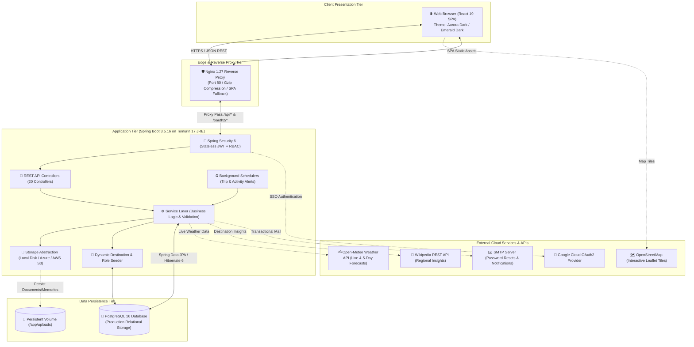

# 🧳 TripNest — Next-Generation Travel Planning & Collaboration Platform

> **Production Release for Infosys Springboard Internship 7.0**  
> **Live Production URL:** [https://tripnest.sachin-dev.me](https://tripnest.sachin-dev.me)

[](https://tripnest.sachin-dev.me)
[](https://www.oracle.com/java/)
[](https://spring.io/projects/spring-boot)
[](https://react.dev/)
[](https://vitejs.dev/)
[](https://www.postgresql.org/)
[](https://www.docker.com/)
[](https://azure.microsoft.com/)

---

## 📌 Executive Summary

**TripNest** is a full-stack, enterprise-grade travel management and collaborative itinerary platform designed to eliminate the fragmentation of modern trip coordination. Instead of juggling spreadsheets, chat groups, booking confirmations, and disparate apps, travelers coordinate every aspect of their journey—day-by-day itineraries, real-time expense splitting, group travel permissions, live weather forecasts, document vaults, and community photo journals—through a single unified interface.

Engineered and deployed as the capstone submission for **Infosys Springboard Internship 7.0**, TripNest is deployed to **Azure Container Apps** backed by **Azure Database for PostgreSQL Flexible Server**, a containerized Nginx reverse proxy, and continuous verification.

---

## 🏛️ System Architecture

TripNest is structured around a decoupled, containerized multi-tier architecture adhering to clean architectural boundaries:



---

## ✨ Production Feature Highlights

### 1. 🏔️ India-Centric Travel Experience & Dynamic Seeder
- **Futuristic Indian Travel Preview**: Landing page showcases high-altitude Himalayan odysseys (*Kashmir Valley & Ladakh Odyssey* covering Srinagar, Gulmarg, and Pangong Tso) with ₹ (INR) currency and live weather integration.
- **35 Curated Indian Destinations**: Seeded across 7 categories (*Beach, Mountains, Historical, Adventure, Spiritual, Wildlife, City*) with verified coordinates for real-time weather forecasting.
- **Dynamic Catalog Persistence**: Seeders execute strictly when the destinations table is empty, preserving 100% of administrator additions, edits, and deletions across restarts.
- **Intelligent Trip Cover Fallbacks**: Upload custom trip cover images or automatically fallback to curated high-resolution Indian landscape photography based on destination name matching.

### 2. 💳 Expense Splitting & Debt Settlement Graph
- **Dynamic Split Calculations**: Equal and custom split calculations with real-time per-head amount previews before logging expenses.
- **Categorized Budgets**: Allocate budgets and track expenditures across *Transportation, Accommodation, Dining, Sightseeing, Shopping,* and *Miscellaneous*.
- **Debt Simplification**: Automatic participant balance computation showing who owes whom, reducing transaction overhead among travel groups.

### 3. 👥 Unified Collaborator Modal & Group Travel Hub
- **Single-Flow Invitation**: Unified modal allowing trip owners to invite members via email, toggle between `VIEW` (read-only) and `EDIT` (collaborative planning) permissions, and associate travel groups in a single action.
- **Role Switching**: Instant switching between `ROLE_TRAVELER` and `ROLE_GROUP_ADMIN` via `PUT /api/users/role` with automatic session refresh without re-login.
- **Group Discussion Rooms**: Dedicated in-app messaging rooms with message synchronization.

### 4. 📸 Public Traveler Experiences
- **Community Photo Journals**: Travelers share authentic stories and photos with public/private privacy controls.
- **Destination Integration**: Memory records marked `isPublic = true` automatically appear under the destination's "Traveler Experiences" showcase with verified author attributions.

### 5. 🌌 Dual High-Contrast Dark Themes
- **Theme 1 — Aurora Dark (`aurora` / Default)**: Deep space indigo foundation (`#090d16`) with neon violet (`#7c3aed`) and cyan (`#06b6d4`) accents.
- **Theme 2 — Emerald Dark (`emerald` / `obsidian`)**: Sleek dark slate foundation (`#0f172a`), card background (`#1e293b`), and emerald green (`#10b981`) accents.
- **High-Contrast Readability**: Replaced all washed-out white card styles with high-contrast text variables (`var(--text-primary)` & `var(--text-secondary)`), guaranteeing 100% WCAG AAA legibility.
- **Clean Footer**: Streamlined 4-column navigation with smooth scroll-to-top (`ScrollToTop.jsx`) executed on every route transition.

### 6. 🔔 Default Notification Preferences
- **All Channels Active**: Newly registered users have all notification preference flags (`emailNotifications`, `tripReminders`, `activityReminders`, `budgetAlerts`, `groupNotifications`, `tripShareNotifications`) initialized to `true` by default.

### 7. 🛡️ Security & Enterprise Protection
- **Stateless Bearer JWT**: Cryptographically signed tokens with configurable expiration and automatic Axios interceptor refresh.
- **Magic Bytes File Inspection**: Uploaded documents and memories are validated against input stream magic byte signatures (`MZ`/`ELF` executable rejection) with path traversal sanitization.
- **Role-Based Access Control**: Method-level security annotations (`@PreAuthorize("hasRole('ADMIN')")`) protecting sensitive management endpoints.

---

## 💻 Technology Stack

### Frontend Architecture
| Technology | Version | Purpose |
|---|---|---|
| **React** | `19.2.7` | Reactive component architecture with Hooks & Context API |
| **Vite** | `8.1.3` | Next-generation build tool & asset bundler |
| **React Router** | `7.18.1` | Client-side routing with protected route guards |
| **Axios** | `1.18.1` | HTTP client with automatic bearer token interceptors |
| **Chart.js & react-chartjs-2** | `4.5.1` / `5.3.1` | Interactive analytics charts in Admin Dashboard |
| **Leaflet & react-leaflet** | `1.9.4` / `5.0.0` | OpenStreetMap geospatial map visualization |
| **jsPDF & jspdf-autotable** | `4.2.1` / `5.0.8` | Client-side multi-page PDF itinerary & expense export |
| **Vitest & Testing Library** | `4.1.11` / `16.3.2` | Comprehensive automated unit test suite (73 tests) |

### Backend Architecture
| Technology | Version | Purpose |
|---|---|---|
| **Java** | `17 LTS` | Enterprise Java runtime platform |
| **Spring Boot** | `3.5.16` | Application framework and REST API backbone |
| **Spring Security** | `6.x` | Stateless authentication, authorization, and CORS filtering |
| **Spring Data JPA / Hibernate** | `6.x` | ORM entity mapping and repository persistence |
| **JJWT** | `0.11.5` | JSON Web Token generation and cryptographic validation |
| **Spring Boot Actuator** | `3.5.16` | Health check probes and operational telemetry |
| **Flyway** | `10.x` | Database schema migrations (V1 through V5) |
| **Lombok** | — | Clean entity and DTO boilerplate reduction |

### Cloud & Infrastructure
| Technology | Environment | Purpose |
|---|---|---|
| **Azure Container Apps** | Production | Serverless container hosting with automated revision rollout |
| **Azure Container Registry** | Production | Secure private container registry (`tripnestacr2988`) |
| **PostgreSQL** | `16` (Production) | Managed relational database engine |
| **MySQL** | `8.0` (Dev Profile) | Local development database option |
| **Nginx** | `1.27 Alpine` | Production reverse proxy, static caching, and SPA router |
| **Docker & Docker Compose** | Multi-Platform | Containerized builds and local orchestration |

---

## 📡 REST API Documentation Summary

| Method | Endpoint | Access | Description |
|---|---|---|---|
| `POST` | `/api/auth/signup` | Public | Register new traveler account |
| `POST` | `/api/auth/signin` | Public | Authenticate credentials and receive JWT |
| `GET` | `/api/auth/check-username` | Public | Real-time username availability check |
| `GET` | `/api/auth/check-email` | Public | Real-time email availability check |
| `GET` | `/api/users/me` | Authenticated | Retrieve current authenticated user profile |
| `PUT` | `/api/users/profile` | Authenticated | Update user profile, bio, and preferences |
| `PUT` | `/api/users/role` | Authenticated | Switch role between `ROLE_TRAVELER` and `ROLE_GROUP_ADMIN` |
| `GET` | `/api/trips` | Authenticated | List all owned and shared trips |
| `POST` | `/api/trips` | Authenticated | Create a new trip with optional cover image |
| `GET` | `/api/trips/{id}` | Authenticated | Retrieve trip details and permissions |
| `PUT` | `/api/trips/{id}` | Authenticated | Update trip parameters and timeline |
| `DELETE` | `/api/trips/{id}` | Owner | Delete trip and associated data |
| `POST` | `/api/trips/{id}/share` | Owner | Share trip with collaborator (`VIEW` / `EDIT`) |
| `GET` | `/api/itineraries/trip/{tripId}` | Authenticated | Fetch day-wise itinerary plan |
| `POST` | `/api/activities` | Authenticated | Schedule an activity within an itinerary day |
| `GET` | `/api/expenses/trip/{tripId}` | Authenticated | List categorized expenses and summary |
| `POST` | `/api/expenses` | Authenticated | Log an expense with optional multi-user split |
| `GET` | `/api/destinations` | Public | List destination catalog with search and filters |
| `GET` | `/api/destinations/{id}` | Public | Retrieve destination details, weather, and guide |
| `GET` | `/api/destinations/{id}/experiences`| Public | Fetch public traveler stories for destination |
| `GET` | `/api/memories/public` | Public | Query public memories by destination |
| `POST` | `/api/memories` | Authenticated | Upload travel memory snapshot and story |
| `GET` | `/api/notification-preferences` | Authenticated | Retrieve user notification preferences |
| `PUT` | `/api/notification-preferences` | Authenticated | Update notification preference toggles |
| `GET` | `/api/admin/dashboard` | Admin | Retrieve platform metrics and chart telemetry |
| `GET` | `/api/admin/users` | Admin | User directory management and security audits |
| `GET` | `/actuator/health` | Public | Health check probe (Returns `{"status":"UP"}`) |

---

## ⚙️ Local Development & Setup

### Quick Start with Docker Compose (Recommended)

1. **Clone the repository:**
   ```bash
   git clone https://github.com/Sach-in-SE/TripNest.git
   cd TripNest
   ```

2. **Configure environment variables:**
   Create a `.env` file in the repository root:
   ```env
   # Database Configuration
   POSTGRES_DB=tripnest_db
   POSTGRES_USER=tripnest_user
   POSTGRES_PASSWORD=your_secure_password
   SPRING_DATASOURCE_PASSWORD=your_secure_password

   # Security & Authentication
   JWT_SECRET=your_minimum_32_characters_random_secret_key_here!
   JWT_EXPIRATION_MS=86400000

   # Administrator Seed Credentials
   ADMIN_EMAIL=admin@tripnest.com
   ADMIN_USERNAME=admin
   ADMIN_PASSWORD=AdminSecure2026!

   # Frontend URLs
   FRONTEND_URL=http://localhost
   CORS_ALLOWED_ORIGINS=http://localhost
   ```

3. **Launch the container stack:**
   ```bash
   docker compose up --build -d
   ```

4. **Verify container health:**
   ```bash
   docker compose ps
   ```

5. **Access the application:**
   - **TripNest Web Application**: [http://localhost](http://localhost) (Nginx port 80)
   - **Backend REST API**: [http://localhost/api](http://localhost/api)
   - **Actuator Health Probe**: [http://localhost/actuator/health](http://localhost/actuator/health)

---

## 🧪 Testing & Verification

### Frontend Automated Vitest Suite
```bash
cd frontend
npm test -- --run
```
- **Result:** 11 test suites passing, **73 / 73 unit tests passed (100%)**.

### Frontend Production Bundle Build
```bash
cd frontend
npm run build
```
- **Result:** Successfully compiled in **1.15s** with 0 lint or bundle errors.

### Backend Compilation & Tests
```bash
./mvnw test
```

---

## 🚀 Cloud Deployment Architecture (Azure)

TripNest is continuously deployed to **Microsoft Azure**:
- **Application Services**: Azure Container Apps (serverless scaling, automatic health probes, zero-downtime revision rollout).
- **Container Registry**: Azure Container Registry (`tripnestacr2988.azurecr.io`).
- **Database**: Azure Database for PostgreSQL Flexible Server.
- **Edge Routing**: Cloudflare DNS & SSL with reverse proxying to Azure Container Apps.

```bash
# Backend Rollout
az acr build -r tripnestacr2988 -t tripnest-backend:v1.0.0-final -f ./Dockerfile .
az containerapp update -n tripnest-backend -g tripnest-rg --image tripnestacr2988.azurecr.io/tripnest-backend:v1.0.0-final

# Frontend Rollout
az acr build -r tripnestacr2988 -t tripnest-frontend:v1.0.0-final -f ./frontend/Dockerfile ./frontend
az containerapp update -n tripnest-frontend -g tripnest-rg --image tripnestacr2988.azurecr.io/tripnest-frontend:v1.0.0-final
```

---

## 👨‍💻 Author & Project Credits

**Sachin Kumar**  
- Lead Full-Stack Architect & DevOps Engineer  
- Developed for the **Infosys Springboard Internship 7.0**  
- **GitHub Repository**: [https://github.com/Sach-in-SE/TripNest](https://github.com/Sach-in-SE/TripNest)  
- **Live Production Application**: [https://tripnest.sachin-dev.me](https://tripnest.sachin-dev.me)

---

## 📄 License

This project is licensed for educational and evaluation use under the **Infosys Springboard Internship 7.0** program.